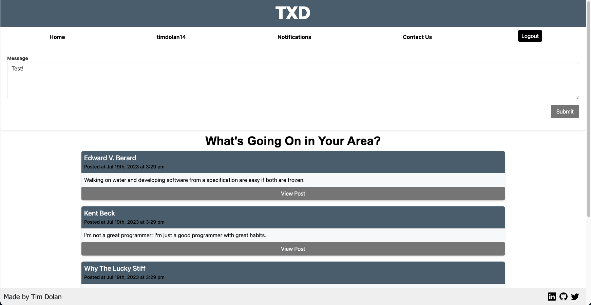

# TXD

## Deployed Link
https://txd-74be239d79ad.herokuapp.com/

## GitHub Repo
https://github.com/timdolan14/TXD

## Description

Introducing our innovative social media platform, where community engagement meets local connection! With our user-friendly interface, users can share updates, events, and thoughts exclusive to their area. Posts are seamlessly visible to all nearby users, fostering real-time interactions and a sense of belonging. From sharing neighborhood news to discovering local gems, this platform empowers users to engage authentically with their communities. Leave comments, join discussions, and connect with neighbors like never before. Our advanced location-based technology ensures a relevant and personalized experience, making socializing effortless and meaningful. Embrace the power of proximity and build vibrant connections on our one-of-a-kind social media!

## How does it work?
Our app utilizes advanced technologies like JavaScript, MERN Stack (MongoDB, Express.js, React.js, Node.js), GraphQL, and npm packages. By utilizing GraphQL, we efficiently manage user profiles and posts. React dynamically populates personalized pages for each user, while API routes are neatly organized using separate JavaScript files, ensuring clean code structure through proper GraphQL queries and mutations.

## Dependencies
All required packages are listed in the included package.json file. On the root level, Simply run "npm install" in the terminal to install all of the required packages.

## Contributors
- [Tim Dolan](https://github.com/timdolan14)

## Usage
To review this Site Creation, you can review the notes in each section. Open the Chrome DevTools by pressing Command+Option+I (macOS) or Control+Shift+I (Windows). A console panel should open either below or to the side of the webpage in the browser.

## License
N/A